```mermaid
---
config:
  flowchart:
    curve: linear
---
flowchart LR
    sensor_a:::defClass@{ img: "data:image/svg+xml;base64,PHN2ZyB4bWxucz0iaHR0cDovL3d3dy53My5vcmcvMjAwMC9zdmciIHdpZHRoPSIxZW0iIGhlaWdodD0iMWVtIiB2aWV3Qm94PSIwIDAgMjQgMjQiPgoJPHBhdGggZD0iTTAgMGgyNHYyNEgweiIgZmlsbD0ibm9uZSIgLz4KCTxnIGZpbGw9ImN1cnJlbnRDb2xvciI+CgkJPHBhdGggZD0iTTEyIDE1YTMgMyAwIDEgMCAwLTZhMyAzIDAgMCAwIDAgNiIgLz4KCQk8cGF0aCBmaWxsLXJ1bGU9ImV2ZW5vZGQiIGQ9Ik0yMiAxMmMwIDUuNTIzLTQuNDc3IDEwLTEwIDEwUzIgMTcuNTIzIDIgMTJTNi40NzcgMiAxMiAyczEwIDQuNDc3IDEwIDEwbS0yIDBhOCA4IDAgMSAxLTE2IDBhOCA4IDAgMCAxIDE2IDAiIGNsaXAtcnVsZT0iZXZlbm9kZCIgLz4KCTwvZz4KPC9zdmc+Cg==", label: "엣지 센서", pos: "t", h: "60", constraint: "on"}
    sensor_b:::defClass@{ img: "data:image/svg+xml;base64,PHN2ZyB4bWxucz0iaHR0cDovL3d3dy53My5vcmcvMjAwMC9zdmciIHdpZHRoPSIxZW0iIGhlaWdodD0iMWVtIiB2aWV3Qm94PSIwIDAgMjQgMjQiPgoJPHBhdGggZD0iTTAgMGgyNHYyNEgweiIgZmlsbD0ibm9uZSIgLz4KCTxnIGZpbGw9ImN1cnJlbnRDb2xvciI+CgkJPHBhdGggZD0iTTEyIDE1YTMgMyAwIDEgMCAwLTZhMyAzIDAgMCAwIDAgNiIgLz4KCQk8cGF0aCBmaWxsLXJ1bGU9ImV2ZW5vZGQiIGQ9Ik0yMiAxMmMwIDUuNTIzLTQuNDc3IDEwLTEwIDEwUzIgMTcuNTIzIDIgMTJTNi40NzcgMiAxMiAyczEwIDQuNDc3IDEwIDEwbS0yIDBhOCA4IDAgMSAxLTE2IDBhOCA4IDAgMCAxIDE2IDAiIGNsaXAtcnVsZT0iZXZlbm9kZCIgLz4KCTwvZz4KPC9zdmc+Cg==", label: "엣지 센서", pos: "t", h: "60", constraint: "on"}
    sensor_c:::defClass@{ img: "data:image/svg+xml;base64,PHN2ZyB4bWxucz0iaHR0cDovL3d3dy53My5vcmcvMjAwMC9zdmciIHdpZHRoPSIxZW0iIGhlaWdodD0iMWVtIiB2aWV3Qm94PSIwIDAgMjQgMjQiPgoJPHBhdGggZD0iTTAgMGgyNHYyNEgweiIgZmlsbD0ibm9uZSIgLz4KCTxnIGZpbGw9ImN1cnJlbnRDb2xvciI+CgkJPHBhdGggZD0iTTEyIDE1YTMgMyAwIDEgMCAwLTZhMyAzIDAgMCAwIDAgNiIgLz4KCQk8cGF0aCBmaWxsLXJ1bGU9ImV2ZW5vZGQiIGQ9Ik0yMiAxMmMwIDUuNTIzLTQuNDc3IDEwLTEwIDEwUzIgMTcuNTIzIDIgMTJTNi40NzcgMiAxMiAyczEwIDQuNDc3IDEwIDEwbS0yIDBhOCA4IDAgMSAxLTE2IDBhOCA4IDAgMCAxIDE2IDAiIGNsaXAtcnVsZT0iZXZlbm9kZCIgLz4KCTwvZz4KPC9zdmc+Cg==", label: "엣지 센서", pos: "t", h: "60", constraint: "on"}
    sensor_d:::defClass@{ img: "data:image/svg+xml;base64,PHN2ZyB4bWxucz0iaHR0cDovL3d3dy53My5vcmcvMjAwMC9zdmciIHdpZHRoPSIxZW0iIGhlaWdodD0iMWVtIiB2aWV3Qm94PSIwIDAgMjQgMjQiPgoJPHBhdGggZD0iTTAgMGgyNHYyNEgweiIgZmlsbD0ibm9uZSIgLz4KCTxnIGZpbGw9ImN1cnJlbnRDb2xvciI+CgkJPHBhdGggZD0iTTEyIDE1YTMgMyAwIDEgMCAwLTZhMyAzIDAgMCAwIDAgNiIgLz4KCQk8cGF0aCBmaWxsLXJ1bGU9ImV2ZW5vZGQiIGQ9Ik0yMiAxMmMwIDUuNTIzLTQuNDc3IDEwLTEwIDEwUzIgMTcuNTIzIDIgMTJTNi40NzcgMiAxMiAyczEwIDQuNDc3IDEwIDEwbS0yIDBhOCA4IDAgMSAxLTE2IDBhOCA4IDAgMCAxIDE2IDAiIGNsaXAtcnVsZT0iZXZlbm9kZCIgLz4KCTwvZz4KPC9zdmc+Cg==", label: "엣지 센서", pos: "t", h: "60", constraint: "on"}
    server:::defClass@{ img: "data:image/svg+xml;base64,PHN2ZyB4bWxucz0iaHR0cDovL3d3dy53My5vcmcvMjAwMC9zdmciIHdpZHRoPSIxZW0iIGhlaWdodD0iMWVtIiB2aWV3Qm94PSIwIDAgMjQgMjQiPgoJPHBhdGggZD0iTTAgMGgyNHYyNEgweiIgZmlsbD0ibm9uZSIgLz4KCTxwYXRoIGZpbGw9Im5vbmUiIHN0cm9rZT0iY3VycmVudENvbG9yIiBzdHJva2UtbGluZWNhcD0icm91bmQiIHN0cm9rZS1saW5lam9pbj0icm91bmQiIHN0cm9rZS13aWR0aD0iMiIgZD0iTTQuNSAxMWgxNU02Ljk5OSAxNEgxMG02Ljk5OSAwSDE3TTQgMTZ2LTQuMDU2YTQgNCAwIDAgMSAuNDIyLTEuNzg5TDYgN2gxMmwxLjU3OCAzLjE1NWE0IDQgMCAwIDEgLjQyMiAxLjc5VjE2YTEgMSAwIDAgMS0xIDFINWExIDEgMCAwIDEtMS0xIiAvPgo8L3N2Zz4K", label: "엣지 서버", pos: "t", h: "80", constraint: "on"}
    db:::defClass@{ img: "data:image/svg+xml;base64,PHN2ZyB4bWxucz0iaHR0cDovL3d3dy53My5vcmcvMjAwMC9zdmciIHdpZHRoPSIxZW0iIGhlaWdodD0iMWVtIiB2aWV3Qm94PSIwIDAgMjQgMjQiPgoJPHBhdGggZD0iTTAgMGgyNHYyNEgweiIgZmlsbD0ibm9uZSIgLz4KCTxnIGZpbGw9Im5vbmUiIHN0cm9rZT0iY3VycmVudENvbG9yIiBzdHJva2Utd2lkdGg9IjEuNSI+CgkJPHBhdGggZD0iTTUgMTJ2NnMwIDMgNyAzczctMyA3LTN2LTYiIC8+CgkJPHBhdGggZD0iTTUgNnY2czAgMyA3IDNzNy0zIDctM1Y2IiAvPgoJCTxwYXRoIGQ9Ik0xMiAzYzcgMCA3IDMgNyAzczAgMy03IDNzLTctMy03LTNzMC0zIDctM1oiIC8+Cgk8L2c+Cjwvc3ZnPgo=", label: "데이터베이스", pos: "t", h: "70", constraint: "on"}
    storage:::defClass@{ img: "data:image/svg+xml;base64,PHN2ZyB4bWxucz0iaHR0cDovL3d3dy53My5vcmcvMjAwMC9zdmciIHdpZHRoPSIxZW0iIGhlaWdodD0iMWVtIiB2aWV3Qm94PSIwIDAgNTEyIDUxMiI+Cgk8cGF0aCBkPSJNMCAwaDUxMnY1MTJIMHoiIGZpbGw9Im5vbmUiIC8+Cgk8cGF0aCBmaWxsPSJjdXJyZW50Q29sb3IiIGQ9Ik0xNiA0OHY0MTZoNDgwVjQ4Wm00NDggMzg0SDQ4di05Nmg0MTZabTAtMTI4SDQ4di05Nmg0MTZaTTQ4IDE3NlY4MGg0MTZ2OTZaIiAvPgoJPHBhdGggZmlsbD0iY3VycmVudENvbG9yIiBkPSJNODAgMTEyaDMydjMySDgwem0wIDEyOGgzMnYzMkg4MHptMCAxMjhoMzJ2MzJIODB6IiAvPgo8L3N2Zz4K", label: "스토리지", pos: "t", h: "60", constraint: "on"}
    edge_backend:::defClass@{ img: "data:image/svg+xml;base64,PHN2ZyB4bWxucz0iaHR0cDovL3d3dy53My5vcmcvMjAwMC9zdmciIHdpZHRoPSIxZW0iIGhlaWdodD0iMWVtIiB2aWV3Qm94PSIwIDAgMjQgMjQiPgoJPHBhdGggZD0iTTAgMGgyNHYyNEgweiIgZmlsbD0ibm9uZSIgLz4KCTxnIGZpbGw9Im5vbmUiIHN0cm9rZT0iY3VycmVudENvbG9yIiBzdHJva2Utd2lkdGg9IjEuNSI+CgkJPHBhdGggZD0iTTIgMTdjMC0xLjg4NiAwLTIuODI4LjU4Ni0zLjQxNFM0LjExNCAxMyA2IDEzaDEyYzEuODg2IDAgMi44MjggMCAzLjQxNC41ODZTMjIgMTUuMTE0IDIyIDE3czAgMi44MjgtLjU4NiAzLjQxNFMxOS44ODYgMjEgMTggMjFINmMtMS44ODYgMC0yLjgyOCAwLTMuNDE0LS41ODZTMiAxOC44ODYgMiAxN1pNMiA2YzAtMS44ODYgMC0yLjgyOC41ODYtMy40MTRTNC4xMTQgMiA2IDJoMTJjMS44ODYgMCAyLjgyOCAwIDMuNDE0LjU4NlMyMiA0LjExNCAyMiA2czAgMi44MjgtLjU4NiAzLjQxNFMxOS44ODYgMTAgMTggMTBINmMtMS44ODYgMC0yLjgyOCAwLTMuNDE0LS41ODZTMiA3Ljg4NiAyIDZaIiAvPgoJCTxwYXRoIHN0cm9rZS1saW5lY2FwPSJyb3VuZCIgZD0iTTExIDZoN002IDZoMm0zIDExaDdNNiAxN2gyIiAvPgoJPC9nPgo8L3N2Zz4K", label: "수집 백엔드", pos: "t", h: "60", constraint: "on"}
    mqtt:::defClass@{ img: "data:image/svg+xml;base64,PHN2ZyB4bWxucz0iaHR0cDovL3d3dy53My5vcmcvMjAwMC9zdmciIHdpZHRoPSIxZW0iIGhlaWdodD0iMWVtIiB2aWV3Qm94PSIwIDAgMjQgMjQiPgoJPHBhdGggZD0iTTAgMGgyNHYyNEgweiIgZmlsbD0ibm9uZSIgLz4KCTxnIGZpbGw9Im5vbmUiIHN0cm9rZT0iY3VycmVudENvbG9yIiBzdHJva2Utd2lkdGg9IjEuNSI+CgkJPHBhdGggZD0iTTIgMTdjMC0xLjg4NiAwLTIuODI4LjU4Ni0zLjQxNFM0LjExNCAxMyA2IDEzaDEyYzEuODg2IDAgMi44MjggMCAzLjQxNC41ODZTMjIgMTUuMTE0IDIyIDE3czAgMi44MjgtLjU4NiAzLjQxNFMxOS44ODYgMjEgMTggMjFINmMtMS44ODYgMC0yLjgyOCAwLTMuNDE0LS41ODZTMiAxOC44ODYgMiAxN1pNMiA2YzAtMS44ODYgMC0yLjgyOC41ODYtMy40MTRTNC4xMTQgMiA2IDJoMTJjMS44ODYgMCAyLjgyOCAwIDMuNDE0LjU4NlMyMiA0LjExNCAyMiA2czAgMi44MjgtLjU4NiAzLjQxNFMxOS44ODYgMTAgMTggMTBINmMtMS44ODYgMC0yLjgyOCAwLTMuNDE0LS41ODZTMiA3Ljg4NiAyIDZaIiAvPgoJCTxwYXRoIHN0cm9rZS1saW5lY2FwPSJyb3VuZCIgZD0iTTExIDZoN002IDZoMm0zIDExaDdNNiAxN2gyIiAvPgoJPC9nPgo8L3N2Zz4K", label: "MQTT", pos: "t", h: "60", constraint: "on"}
    user_backend:::defClass@{ img: "data:image/svg+xml;base64,PHN2ZyB4bWxucz0iaHR0cDovL3d3dy53My5vcmcvMjAwMC9zdmciIHdpZHRoPSIxZW0iIGhlaWdodD0iMWVtIiB2aWV3Qm94PSIwIDAgMjQgMjQiPgoJPHBhdGggZD0iTTAgMGgyNHYyNEgweiIgZmlsbD0ibm9uZSIgLz4KCTxnIGZpbGw9Im5vbmUiIHN0cm9rZT0iY3VycmVudENvbG9yIiBzdHJva2Utd2lkdGg9IjEuNSI+CgkJPHBhdGggZD0iTTIgMTdjMC0xLjg4NiAwLTIuODI4LjU4Ni0zLjQxNFM0LjExNCAxMyA2IDEzaDEyYzEuODg2IDAgMi44MjggMCAzLjQxNC41ODZTMjIgMTUuMTE0IDIyIDE3czAgMi44MjgtLjU4NiAzLjQxNFMxOS44ODYgMjEgMTggMjFINmMtMS44ODYgMC0yLjgyOCAwLTMuNDE0LS41ODZTMiAxOC44ODYgMiAxN1pNMiA2YzAtMS44ODYgMC0yLjgyOC41ODYtMy40MTRTNC4xMTQgMiA2IDJoMTJjMS44ODYgMCAyLjgyOCAwIDMuNDE0LjU4NlMyMiA0LjExNCAyMiA2czAgMi44MjgtLjU4NiAzLjQxNFMxOS44ODYgMTAgMTggMTBINmMtMS44ODYgMC0yLjgyOCAwLTMuNDE0LS41ODZTMiA3Ljg4NiAyIDZaIiAvPgoJCTxwYXRoIHN0cm9rZS1saW5lY2FwPSJyb3VuZCIgZD0iTTExIDZoN002IDZoMm0zIDExaDdNNiAxN2gyIiAvPgoJPC9nPgo8L3N2Zz4K", label: "서빙 백엔드", pos: "t", h: "60", constraint: "on"}
    admin:::defClass@{ img: "data:image/svg+xml;base64,PHN2ZyB4bWxucz0iaHR0cDovL3d3dy53My5vcmcvMjAwMC9zdmciIHdpZHRoPSIxZW0iIGhlaWdodD0iMWVtIiB2aWV3Qm94PSIwIDAgMjQgMjQiPgoJPHBhdGggZD0iTTAgMGgyNHYyNEgweiIgZmlsbD0ibm9uZSIgLz4KCTxnIGZpbGw9Im5vbmUiPgoJCTxwYXRoIGQ9Ik0yIDRoMjB2Nkgyem0yMCAxNkgyVjEwaDIweiIgLz4KCQk8cGF0aCBzdHJva2U9ImN1cnJlbnRDb2xvciIgc3Ryb2tlLWxpbmVjYXA9InNxdWFyZSIgc3Ryb2tlLXdpZHRoPSIyIiBkPSJNMjIgMjBWNEgydjE2bTIwIDBIMm0yMCAwVjEwSDJ2MTAiIC8+CgkJPHBhdGggc3Ryb2tlPSJjdXJyZW50Q29sb3IiIHN0cm9rZS1saW5lY2FwPSJzcXVhcmUiIHN0cm9rZS13aWR0aD0iMiIgZD0iTTYgMTRoMTBNNi4wMDQgNy4wMDRINlY3bTQuMDA0LjAwNEgxMFY3bTQuMDA0LjAwNEgxNFY3IiAvPgoJPC9nPgo8L3N2Zz4K", label: "어드민 툴", pos: "t", h: "60", constraint: "on"}
    user_d:::defClass@{ img: "data:image/svg+xml;base64,PHN2ZyB4bWxucz0iaHR0cDovL3d3dy53My5vcmcvMjAwMC9zdmciIHdpZHRoPSIwLjk0ZW0iIGhlaWdodD0iMWVtIiB2aWV3Qm94PSIwIDAgMTUgMTYiPgoJPHBhdGggZD0iTTAgMGgxNXYxNkgweiIgZmlsbD0ibm9uZSIgLz4KCTxwYXRoIGZpbGw9ImN1cnJlbnRDb2xvciIgZD0iTTcuNSA3YTIuNSAyLjUgMCAwIDEgMC01YTIuNSAyLjUgMCAwIDEgMCA1bTAtNEM2LjY3IDMgNiAzLjY3IDYgNC41UzYuNjcgNiA3LjUgNlM5IDUuMzMgOSA0LjVTOC4zMyAzIDcuNSAzIiAvPgoJPHBhdGggZmlsbD0iY3VycmVudENvbG9yIiBkPSJNMTMuNSAxMWMtLjI4IDAtLjUtLjIyLS41LS41cy4yMi0uNS41LS41cy41LS4yMi41LS41QTIuNSAyLjUgMCAwIDAgMTEuNSA3aC0xYy0uMjggMC0uNS0uMjItLjUtLjVzLjIyLS41LjUtLjVjLjgzIDAgMS41LS42NyAxLjUtMS41UzExLjMzIDMgMTAuNSAzYy0uMjggMC0uNS0uMjItLjUtLjVzLjIyLS41LjUtLjVBMi41IDIuNSAwIDAgMSAxMyA0LjVjMCAuNjItLjIyIDEuMTgtLjYgMS42MmMxLjQ5LjQgMi42IDEuNzYgMi42IDMuMzhjMCAuODMtLjY3IDEuNS0xLjUgMS41bS0xMiAwQy42NyAxMSAwIDEwLjMzIDAgOS41YzAtMS42MiAxLjEtMi45OCAyLjYtMy4zOGMtLjM3LS40NC0uNi0xLS42LTEuNjJBMi41IDIuNSAwIDAgMSA0LjUgMmMuMjggMCAuNS4yMi41LjVzLS4yMi41LS41LjVDMy42NyAzIDMgMy42NyAzIDQuNVMzLjY3IDYgNC41IDZjLjI4IDAgLjUuMjIuNS41cy0uMjIuNS0uNS41aC0xQTIuNSAyLjUgMCAwIDAgMSA5LjVjMCAuMjguMjIuNS41LjVzLjUuMjIuNS41cy0uMjIuNS0uNS41bTkgM2gtNmMtLjgzIDAtMS41LS42Ny0xLjUtMS41di0xQzMgOS41NyA0LjU3IDggNi41IDhoMmMxLjkzIDAgMy41IDEuNTcgMy41IDMuNXYxYzAgLjgzLS42NyAxLjUtMS41IDEuNW0tNC01QTIuNSAyLjUgMCAwIDAgNCAxMS41djFjMCAuMjguMjIuNS41LjVoNmMuMjggMCAuNS0uMjIuNS0uNXYtMUEyLjUgMi41IDAgMCAwIDguNSA5eiIgLz4KPC9zdmc+Cg==", label: "사용자 대시보드", pos: "t", h: "60", constraint: "on"}
    ml:::defClass@{ img: "data:image/svg+xml;base64,PHN2ZyB4bWxucz0iaHR0cDovL3d3dy53My5vcmcvMjAwMC9zdmciIHdpZHRoPSIxZW0iIGhlaWdodD0iMWVtIiB2aWV3Qm94PSIwIDAgMjA0OCAyMDQ4Ij4KCTxwYXRoIGQ9Ik0wIDBoMjA0OHYyMDQ4SDB6IiBmaWxsPSJub25lIiAvPgoJPHBhdGggZmlsbD0iY3VycmVudENvbG9yIiBkPSJNMTk2OCAxMDk1cTM4IDM2IDU5IDg0dDIxIDEwMXQtMjAgOTl0LTU1IDgydC04MSA1NXQtMTAwIDIwcS0yMSAwLTQyLTNsLTQ3MSAyMzVxMSA2IDEgMTJ0MCAxMnEwIDUzLTIwIDk5dC01NSA4MnQtODEgNTV0LTEwMCAyMHEtNTIgMC05OC0yMHQtODItNTR0LTU2LTgxdC0yMS05OHYtMTNxMC02IDItMTRsLTQ3MS0yMzVxLTIxIDMtNDIgM3EtNTMgMC05OS0yMHQtODItNTV0LTU1LTgxdC0yMC0xMDBxMC03MSAzNi0xMzF0OTktOTRsMTc1LTY0MnEtNTQtNjktNTQtMTU3cTAtNTMgMjAtOTl0NTUtODJ0ODEtNTVUNTEyIDBxNjkgMCAxMjggMzR0OTQgOTRoNTgwcTM1LTYwIDk0LTk0dDEyOC0zNHE1MyAwIDk5IDIwdDgyIDU1dDU1IDgxdDIwIDEwMHEwIDQyLTEzIDgxdC0zOSA3M3ptLTQzMiAxODVxMC01NSAyMi0xMDV0NjQtODZsLTQ0OS0zMzdsLTY2MyA0OTdsMiAzMXpNNTEyIDUxMnEtNDcgMC05Mi0xN2wtMTQ0IDUzMHE1NSA1IDEwMyAzMXQ4MiA3MGw2MDYtNDU0bC0zNTAtMjYycS0zNyA0OC05MCA3NXQtMTE1IDI3bTEyNDEgNTE1cTgtMiAxOC0ydDE5LTFoMTBxNSAwIDEwIDFsLTE3Ny01MzJxLTQ5IDE5LTk3IDE5cS0yMCAwLTM5LTNsLTIxNyAxNjN6bS0yMTctODk5cS0yNyAwLTUwIDEwdC00MCAyN3QtMjggNDF0LTEwIDUwcTAgMjcgMTAgNTB0MjcgNDB0NDEgMjh0NTAgMTBxMjcgMCA1MC0xMHQ0MC0yN3QyOC00MXQxMC01MHEwLTI3LTEwLTUwdC0yNy00MHQtNDEtMjh0LTUwLTEwbS0yNTYgMTI4SDc2OGwtMiAzMWw0MDcgMzA1bDE5My0xNDVxLTQyLTM2LTY0LTg2dC0yMi0xMDVNNTEyIDEyOHEtMjcgMC01MCAxMHQtNDAgMjd0LTI4IDQxdC0xMCA1MHEwIDI3IDEwIDUwdDI3IDQwdDQxIDI4dDUwIDEwcTI3IDAgNTAtMTB0NDAtMjd0MjgtNDF0MTAtNTBxMC0yNy0xMC01MHQtMjctNDB0LTQxLTI4dC01MC0xME0xMjggMTI4MHEwIDI3IDEwIDUwdDI3IDQwdDQxIDI4dDUwIDEwcTI3IDAgNTAtMTB0NDAtMjd0MjgtNDF0MTAtNTBxMC0yNy0xMC01MHQtMjctNDB0LTQxLTI4dC01MC0xMHEtMjcgMC01MCAxMHQtNDAgMjd0LTI4IDQxdC0xMCA1MG04OTYgNjQwcTI3IDAgNTAtMTB0NDAtMjd0MjgtNDF0MTAtNTBxMC0yNy0xMC01MHQtMjctNDB0LTQxLTI4dC01MC0xMHEtMjcgMC01MCAxMHQtNDAgMjd0LTI4IDQxdC0xMCA1MHEwIDI3IDEwIDUwdDI3IDQwdDQxIDI4dDUwIDEwbTAtMzg0cTYzIDAgMTE5IDI5dDkyIDgybDM3NS0xODdxLTExLTEyLTIxLTI1dC0xOS0yN0g0NzhxLTggMTQtMTggMjd0LTIyIDI1bDM3NSAxODdxMzUtNTIgOTEtODF0MTIwLTMwbTc2OC0xMjhxMjcgMCA1MC0xMHQ0MC0yN3QyOC00MXQxMC01MHEwLTMzLTE2LTYydC00NC00NmwtMSAxbC0xLTFsMS0xcS0zMi0xOS02Ny0xOXEtMjcgMC01MCAxMHQtNDAgMjd0LTI4IDQxdC0xMCA1MHEwIDI3IDEwIDUwdDI3IDQwdDQxIDI4dDUwIDEwIiAvPgo8L3N2Zz4K", label: "ML 엔진", pos: "t", h: "60", constraint: "on"}

    classDef defClass fill:#ffffff,stroke:#ffffff
    style spot fill:#ffffff,stroke:#000000,stroke-width:2px,rx:4px
    style cloud fill:#ffffff,stroke:#000000,stroke-width:2px,rx:4px
    style enduser fill:#ffffff,stroke:#000000,stroke-width:2px,rx:4px
    style infra1 fill:#ffffff,stroke:#000000,stroke-width:2px,rx:4px
    style infra2 fill:#ffffff,stroke:#000000,stroke-width:2px,rx:4px
    style infra3 fill:#ffffff,stroke:#000000,stroke-width:2px,rx:4px
    style infra_mqtt fill:#ffffff,stroke:#000000,stroke-width:2px,rx:4px

    direction LR
    %% 연결 구성
    subgraph spot ["현장"]
        direction LR
        sensor_a <-. "오디오 업링크 + 명령 다운링크" .-> server
        sensor_b <-. "오디오 업링크 + 명령 다운링크" .-> server
        sensor_c <-. "오디오 업링크 + 명령 다운링크" .-> server
        sensor_d <-. "오디오 업링크 + 명령 다운링크" .-> server
    end

    subgraph cloud ["클라우드"]
        direction LR
        subgraph infra_mqtt [" "]
            mqtt
        end
        subgraph infra1 ["설계 논의 필요(TBD)"]
            direction LR
            ml
        end
        subgraph infra2 [" "]
            direction TB
            edge_backend -.-> storage
            edge_backend -.-> db
        end
        subgraph infra3 [" "]
            direction LR
            user_backend
        end
        infra_mqtt <-.-> infra2 -."TBD".-> infra1 -."TBD".-> infra3
        infra2 -.-> infra3
    end
    
    subgraph enduser ["엔드유저"]
        admin
        user_d
    end

    server <=="상태 발행 / 제어 명령 구독"==> infra_mqtt
    server =="대용량 오디오 업로드"==> infra2
    infra3 <=="API"==> enduser
```

# 시스템 아키텍쳐

> [!NOTE]
> 작성자 : 정현후 
> 작성일 : 2026.05.28 
> 작성버전 : v1 

### 아키텍쳐 플로우
---

---

### 다이어그램 읽는 법 (범례)

| 표기 | 의미 |
|------|------|
| 실선 `═══` | **영역(area) 간** 연결 |
| 점선 `┄┄┄` | **영역 내부** 연결 |
| 양방향 화살표 `↔` | 양방향 통신 |
| 단방향 화살표 `→` | 단방향 — 화살표 방향이 **주(主) 데이터 흐름** |

---

### 영역 구성

- **현장** : 설비 현장에 설치되는 엣지 센서와 엣지 서버
- **클라우드** : 수집·저장·서비스·분석 인프라
  - *메시징* : MQTT 브로커
  - *데이터 수집·저장* : 수집 백엔드 + 스토리지 + DB
  - *서비스* : 서빙 백엔드
  - *분석 (TBD)* : ML 엔진 — 차기 설계
- **엔드유저** : 어드민 툴, 사용자 대시보드

---

### 컴포넌트

| 컴포넌트 | 역할 |
|----------|------|
| 엣지 센서 | 현장 설비음 수집 (MEMS 마이크) |
| 엣지 서버 | 센서 데이터 집계, 클라우드로 업링크 |
| MQTT | 상태/제어 메시지 브로커 |
| 수집 백엔드 | 현장 신호 수집·정리, DB/스토리지 관리 |
| 스토리지 | 원시 오디오 데이터(blob) 저장 |
| DB | 메타데이터·결과 등 구조화 데이터 저장 |
| 서빙 백엔드 | 어드민·대시보드용 조회 응답 및 제어 요청 중계 |
| 어드민 툴 | 운영·관리용 콘솔 |
| 사용자 대시보드 | 엔드유저 조회 화면 |
| ML 엔진 *(TBD)* | 분석·추론 — 차기 설계 |

---

### 연결 (인터페이스)

| 연결 | 표기 | 설명 |
|------|------|------|
| 엣지 센서 ↔ 엣지 서버 | 점선·양방향 (영역 내) | 오디오/결과 업링크 + 설정·명령 다운링크 |
| 엣지 서버 ↔ MQTT | 실선·양방향 (영역 간) | 상태·텔레메트리 발행 / 제어 명령 구독 |
| 엣지 서버 → 수집 백엔드 | 실선·단방향 (영역 간) | 대용량 오디오 업로드 |
| MQTT ↔ 수집 백엔드 | 점선·양방향 (영역 내) | 발행/구독 |
| 수집 백엔드 → 스토리지 | 점선·단방향 | 원시 오디오 저장 |
| 수집 백엔드 → DB | 점선·단방향 | 메타데이터·결과 저장 |
| 수집 백엔드 → 서빙 백엔드 | 점선·단방향 | 조회용 데이터 제공 |
| 서빙 백엔드 ↔ 엔드유저 | 실선·양방향 (영역 간) | 조회 응답 + (어드민) 제어 요청 중계 |

---

### 차기 설계 (TBD)

ML 엔진 연동은 ML 팀과의 협의 완료 후 별도 설계로 진행한다. 현재 v1에서는 **수집 백엔드 → 서빙 백엔드 직결 경로**로 데이터를 조회하며, ML 경유 경로(수집 백엔드 ↔ ML 엔진, ML 엔진 → 서빙 백엔드)는 미확정 상태이다.

| 연결 | 상태 | 비고 |
|------|------|------|
| 수집 백엔드 ↔ ML 엔진 | TBD | 데이터 fetch / presigned URL |
| ML 엔진 → 서빙 백엔드 | TBD | 추론 결과 반환 |

